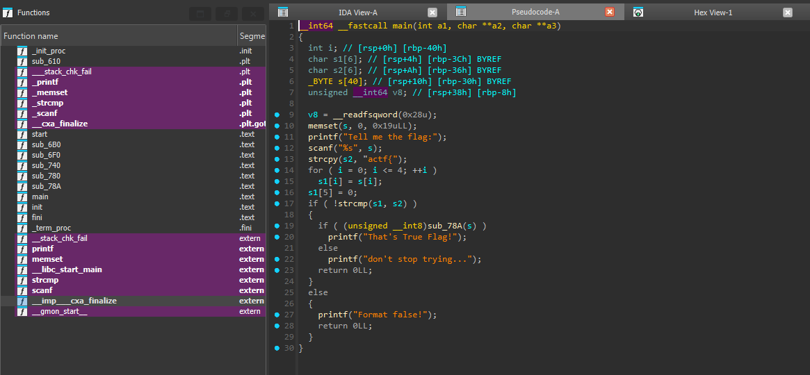
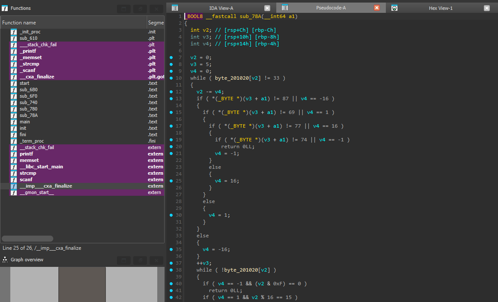
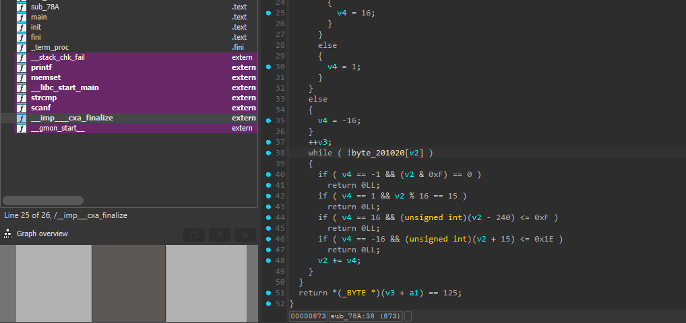
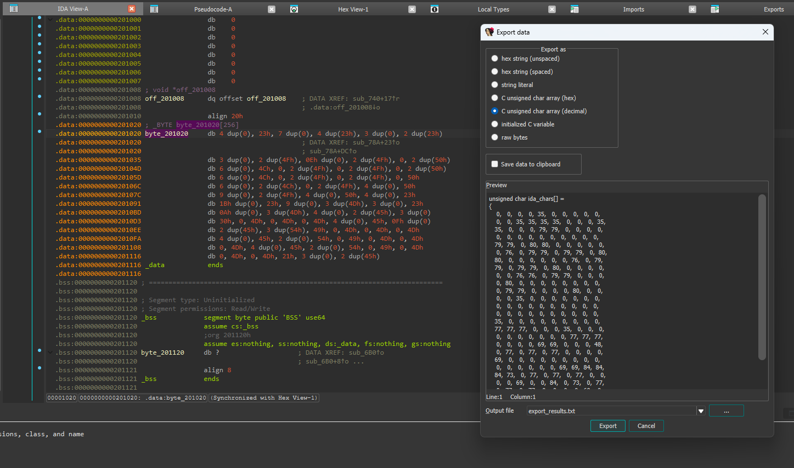
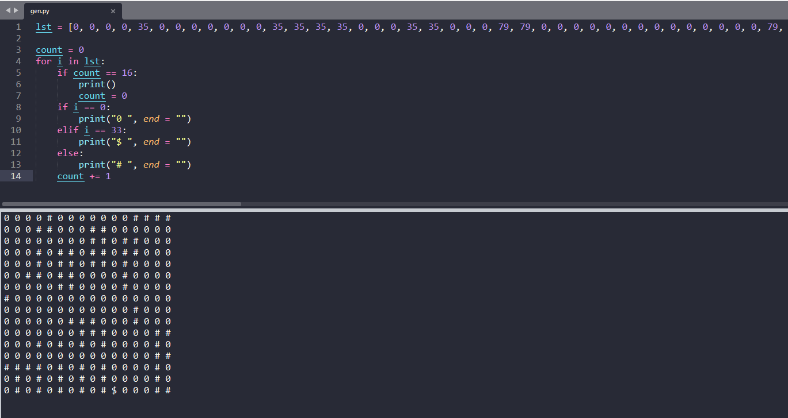
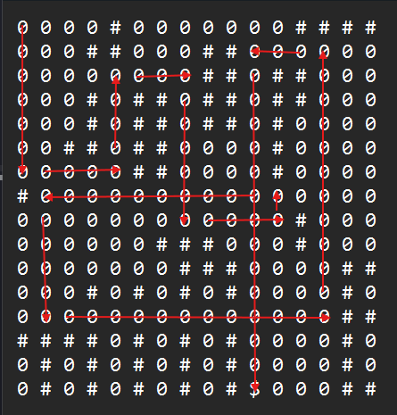

# [ACTF新生赛2020]Oruga

- Tôi sử dụng IDA để có thể dịch mã


- Đọc trong hàm main thì không có gì đặc biệt ngoài hàm sub_78A



- Đọc qua hàm sub_78A thì thấy có byte_201020 có sẵn và cần khai thác, cùng với các giá trị so sánh có sẵn 87, 69, 77, 74


- Đọc và xuất dữ liệu của byte_201020


- Tôi tiến hành tạo lại một ma trận dựa trên dữ liệu của byte_201020

- Sau đó tôi tiến hành giải tay dựa vào:
  - 87 là W (lên trên)
  - 69 là E (sang phải)
  - 77 là M (xuống dưới)
  - 74 là J (sang trái)


- Sau khi tự giải ma trận và nhận được flag

<details>
<summary style="cursor: pointer">FLAG</summary>

```
flag{MEWEMEWJMEWJM}
```
</details>
