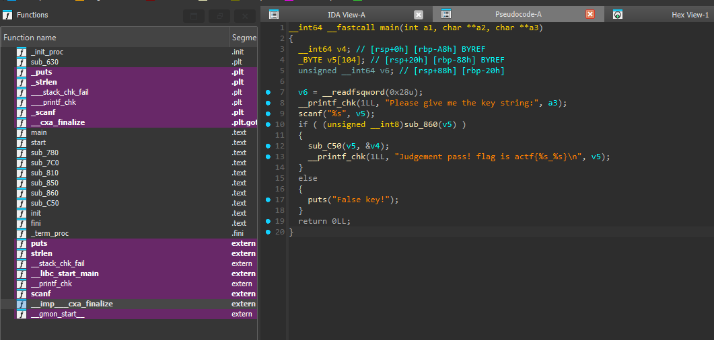
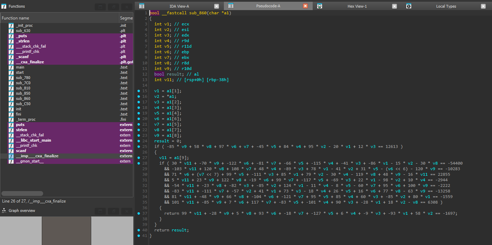
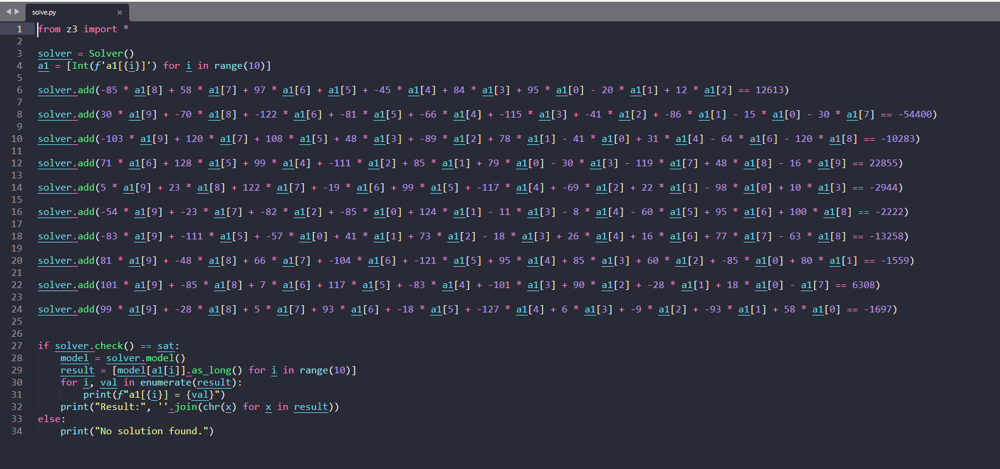

# [ACTF新生赛2020]Universe_final_answer

- Tôi sử dụng IDA để có thể dịch mã


- Tôi đọc hàm main thì thấy ngoài hàm sub_860 thì không có gì cần khai thác cả


- Sau khi đọc bên trong hàm sub_860 thì ta chỉ cần giải được đống dữ liệu số học ở dưới thì ta sẽ có được key


- Tôi tiến hành viết mã python sử dụng z3 module để có thể giải được
- Sau khi chạy tôi có được key và gửi lại vào trong chương trình và đã nhận được flag

<details>
<summary style="cursor: pointer">FLAG</summary>

```
flag{F0uRTy_7w@_42}
```
</details>
