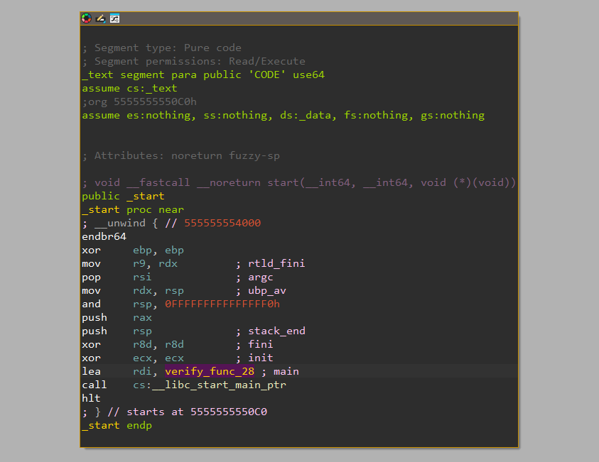
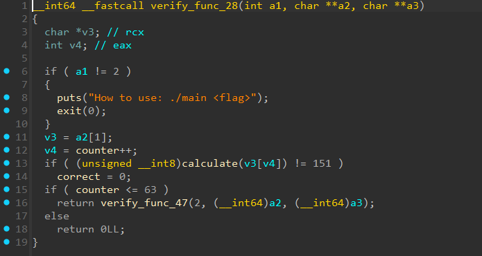

# [Honest](https://dreamhack.io/wargame/challenges/1894)

- Tôi sử dụng IDA để dịch mã
- Sau khi mở lên, tôi tiến hành check hàm `start` trước


- Tôi thấy hàm đầu tiên được gọi đến là `verify_func_28`
- Tiến hành mở hàm này lên


- Điều duy nhất cần để ý ở đây là hàm `calculate`, nó sẽ so sánh giá trị của `<flag>` nhập vào với các giá trị cho trước
- Lần lượt các hàm tiếp theo đó được gọi và đều có `calculate` để so sánh, cho đến khi đủ 64 ký tự thì dừng lại
- Tôi có viết một [file python](./solve.py) mô phỏng lại hàm `calculate` và rồi so sánh các giá trị được cho trong bài để tìm ra flag

<details>
<summary style="cursor: pointer">Key</summary>

```
d052a95e3f7b9487040186703c0eb4c57f2bf27a8fb54e2c8d6c3136543d267c
```
</details>
<details>
<summary style="cursor: pointer">Flag</summary>

```
DH{d052a95e3f7b9487040186703c0eb4c57f2bf27a8fb54e2c8d6c3136543d267c}
```
</details>
